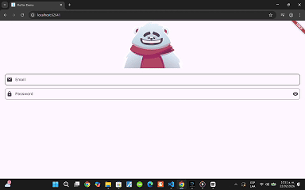

# 🎮 Antonio Coot — 3D Programmer Setup Portfolio


Welcome to my interactive portfolio. This web project showcases a fully modeled programmer desk setup created in **Blender** and brought to life on the web with **Three.js**. Explore an immersive 3D environment with interactive controls, dynamic lighting, and a modern design aesthetic.

## ✨ What this project includes

- 🎨 **Interactive 3D Scene** - A complete programmer's setup modeled in Blender
- 🔄 **Responsive Design** - Works seamlessly across all devices
- 🌐 **Three.js Integration** - GLB model loaded with `GLTFLoader` for web rendering
- 🎯 **Orbit Controls** - Rotate, zoom, and navigate the 3D environment
- 💡 **Dynamic Lighting** - Switch between different environmental lighting setups
- 🔁 **Auto-Rotation Mode** - Automated camera movement for presentation
- 🌙 **Dark Theme** - Modern aesthetic with CSS Flexbox and accessibility

## 🖥️ 3D Setup Elements

The scene includes an authentic programmer's workspace with detailed components:

| Component | Description |
|-----------|-------------|
| 📋 **Desk** | Modern workspace surface |
| 💻 **PC / Monitor** | Multi-monitor professional setup |
| ⌨️ **Keyboard** | Mechanical keyboard precision |
| 🖱️ **Mouse** | Ergonomic pointing device |
| 🌀 **Desk Fan** | Cooling and ambiance |
| 🪑 **Chair** | Comfortable workstation seating |
| 🎁 **Creative Accessories** | Decorative desk items |

> The model is professionally exported from Blender as a `.glb` file with full materials and textures preserved. The original `.blend` file is included for review and further development.

## 📁 Project Structure

```
📦 Portafolio-Web-con-Escena-3D
├── 📄 index.html                          # Main portfolio page
├── 🎨 style.css                           # Styling & responsive layout
├── ⚙️ script.js                           # Three.js integration
├── 📖 README.md                           # Documentation
└── 📁 assets/
    ├── 📁 3d/
    │   ├── 🎮 FNAFFINALOPTIMIZACION.glb  # Exported 3D model
    │   └── 🎨 FNAFFINALOPTIMIZACION.blend # Blender source
    ├── 🖼️ Foto.png                        # Profile avatar
    ├── 🎬 oso.gif                         # Project preview animation
    └── 📸 Screenshots                     # Portfolio showcase images
```

## 🚀 Featured Projects

### 🐻 Animated Bear Login


*Interactive login experience with animated character response in Flutter + Rive*

A creative take on user authentication where the character follows your cursor during email input, covers eyes during password entry, and reacts differently based on login success or failure. Perfect example of UI/UX interactivity.

### 🏪 Oxxo Store (In Development)


*Convenience store 3D modeling project*

Currently features base design and main structure. Future updates will include realistic lighting, product shelves, and detailed merchandising.

---

## 📸 Gallery

### Complete Setup Views

<table>
  <tr>
    <td></td>
    <td></td>
  </tr>
  <tr>
    <td><em>Complete setup with lighting and textures</em></td>
    <td><em>Alternative perspective from Blender modeling</em></td>
  </tr>
</table>

## 🏃 How to Run Locally

> **Note:** Browsers block local `file://` WebGL asset loads. Use a local HTTP server:

### Python
```bash
py -m http.server 8000
# Open http://localhost:8000 in your browser
```

### Node.js
```bash
npx serve .
# Server will start at http://localhost:5000
```

## 🌐 Deployment

The repository is prepared for **GitHub Pages** deployment. The site is live and available at:

📍 **https://antoniocoot.github.io/Portafolio-Web-con-Escena-3D/**

Access the live portfolio directly using the link above!

## ⚙️ Technical Stack

- **Frontend:** HTML5, CSS3, JavaScript (ES6+)
- **3D Rendering:** Three.js, GLTF Loader
- **3D Modeling:** Blender (source files included)
- **Styling:** CSS Flexbox & Grid, Responsive Design
- **Animation:** Three.js OrbitControls
- **Other Projects:** Flutter, Rive, SQL Relational Modeling

## 📝 Notes

- ✅ The 3D scene uses Three.js with OrbitControls for full interactive navigation
- ✅ All portfolio sections included: intro, about, skills, projects, contact
- ✅ GLB and Blender source files included in `/assets/3d/`
- ✅ Mobile-responsive design for seamless viewing on all devices
- ✅ Dark theme with neon accents for modern aesthetic

## 📞 Contact & Connect

Feel free to reach out through any of these channels:

- 🐙 **GitHub:** [AntonioCoot](https://github.com/AntonioCoot)
- 🎮 **Steam:** [Profile Link](https://steamcommunity.com/profiles/76561199079715500/)
- 📧 **Email:** LE24080151@merida.tecnm.mx

---

✨ **Thank you for exploring this portfolio!** I had a blast combining Blender's modeling power with Three.js interactivity to create this immersive web experience. Feel free to explore, interact with the 3D scene, and reach out with feedback or collaboration opportunities!